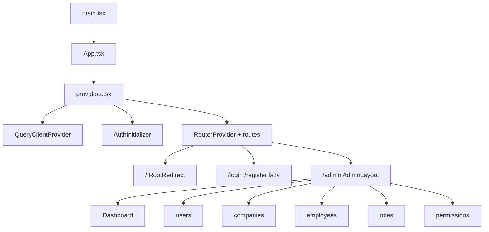

# QLKH Frontend — công nghệ và cấu trúc

> Mô tả stack và bố cục mã nguồn SPA (React). Cập nhật khi thay đổi kiến trúc FE.

---

## Công nghệ (stack)

| Lớp | Thư viện / công cụ | Ghi chú |
|-----|-------------------|---------|
| Runtime UI | React 19 + react-dom ([package.json](../package.json)) | Entry [main.tsx](../src/main.tsx): `createRoot` + `StrictMode` |
| Build / dev | Vite 7 | [vite.config.ts](../vite.config.ts): `@vitejs/plugin-react`, dev server port **3000**, alias `@` → `./src` |
| Ngôn ngữ | TypeScript 5.9 | Build: `tsc -b && vite build` |
| Styling | Tailwind CSS 4 + `@tailwindcss/vite` | Plugin Vite; global CSS [index.css](../src/index.css) |
| React Compiler | `babel-plugin-react-compiler` | Bật trong `vite.config.ts` qua `react({ babel: { plugins: [...] } })` |
| Routing | react-router-dom 7 | `createBrowserRouter` trong [routes.tsx](../src/app/routes.tsx), route lazy-load |
| Server state | TanStack Query 5 | [providers.tsx](../src/app/providers.tsx): `QueryClientProvider`; client [queryClient.ts](../src/config/queryClient.ts) |
| Client state (auth) | Zustand 5 | [store.ts](../src/features/auth/store.ts): `accessToken`, `user`, logout |
| HTTP | Axios | [api.ts](../src/config/api.ts): `baseURL` từ `VITE_API_URL`, `withCredentials`, interceptor JWT + refresh |
| Form / validation | react-hook-form + zod + `@hookform/resolvers` | Auth và form CRUD |
| Bảng dữ liệu | TanStack Table 8 | [DataTable.tsx](../src/components/common/DataTable.tsx) + các trang list |
| Icon | lucide-react | |
| Thông báo | react-hot-toast | Trong [providers.tsx](../src/app/providers.tsx) |
| Ngày giờ | dayjs | Format thời gian nơi cần |
| Lint | ESLint 9 + typescript-eslint + react-hooks / react-refresh | `npm run lint` |

**Biến môi trường:** `VITE_API_URL` (file `.env` ở root project) — fallback trong [constants.ts](../src/config/constants.ts).

---

## Luồng ứng dụng (tóm tắt)



- [App.tsx](../src/app/App.tsx): `Providers` + `RouterProvider`.
- [providers.tsx](../src/app/providers.tsx): TanStack Query + `AuthInitializer` + `Toaster`.
- [routes.tsx](../src/app/routes.tsx): `/` → [RootRedirect.tsx](../src/app/RootRedirect.tsx); `/login`, `/register` lazy; `/admin` + children lazy (layout không lazy).

---

## Cấu trúc thư mục `src/`

```
src/
├── main.tsx                 # bootstrap React
├── index.css                # Tailwind / global CSS
├── app/
│   ├── App.tsx
│   ├── providers.tsx
│   ├── routes.tsx
│   ├── RootRedirect.tsx     # / → /login hoặc /admin
│   └── AuthInitializer.tsx
├── config/
│   ├── api.ts               # axios + interceptors
│   ├── constants.ts         # API_BASE_URL, PAGE_SIZE, …
│   └── queryClient.ts
├── types/
│   └── api.ts               # ApiResponse, meta chung
├── utils/
│   ├── error.ts
│   └── is403Error.ts
├── components/
│   ├── layout/              # AdminLayout, Sidebar, Header
│   ├── common/              # DataTable, Pagination, Modal, ConfirmDialog, AccessDenied, …
│   └── ui/                  # Button, Input, Select, Badge, Spinner, FileUpload, …
└── features/                # mỗi domain một package
    ├── auth/                # api, types, store, hooks, LoginPage, RegisterPage
    ├── user/
    ├── company/
    ├── employee/
    ├── role/
    ├── permission/
    ├── dashboard/
    └── file/                  # upload hook + api
```

**Quy ước mỗi feature** (lặp cho `user`, `company`, `role`, `permission`, …):

- `api.ts` — REST qua `api` từ `@/config/api`.
- `types.ts` — kiểu TypeScript.
- `hooks/use*.ts` — TanStack Query (query/mutation).
- `components/*Page.tsx` — trang danh sách; `*Form.tsx` — form tạo/sửa.

**Admin shell:** [AdminLayout.tsx](../src/components/layout/AdminLayout.tsx) đọc `accessToken` (Zustand), không có token → `Navigate` `/login`; [Sidebar.tsx](../src/components/layout/Sidebar.tsx) liên kết `/admin/...`.

---

## Routing

| Path | Nội dung |
|------|-----------|
| `/` | `RootRedirect` |
| `/login`, `/register` | Trang auth (lazy) |
| `/admin` | Dashboard (index, lazy) |
| `/admin/users` | User list (lazy) |
| `/admin/companies` | Company list (lazy) |
| `/admin/employees` | Employee list (lazy) |
| `/admin/roles` | Role list (lazy) |
| `/admin/permissions` | Permission list (lazy) |

**Ghi chú:** Route FE cho module **salary** của backend (nếu có) **chưa** được khai báo trong [routes.tsx](../src/app/routes.tsx) tại thời điểm viết tài liệu này.

---

## Liên quan tài liệu khác

- [ARCHITECTURE.md](./ARCHITECTURE.md) — luồng request/API phía server mà SPA gọi tới.
- [API_SPEC.md](./API_SPEC.md) — hợp đồng REST.
- [CLAUDE.md](../CLAUDE.md) — quy tắc đọc trước khi sửa code.
